# Домашнее задание к занятию «Основы Git»

## Задание 1
Регистрация аккаунта на GitLab приведена на рисунке 1.1.</br>

</br>
Рисунок 1.1. Регистрация аккаунта на GitLab.</br>
Далее был создан публичный репозиторий [devops-netology](https://gitlab.com/netology-group2/devops-netology). Настройка доступа репозитория представлена на рисунке 1.2.</br>

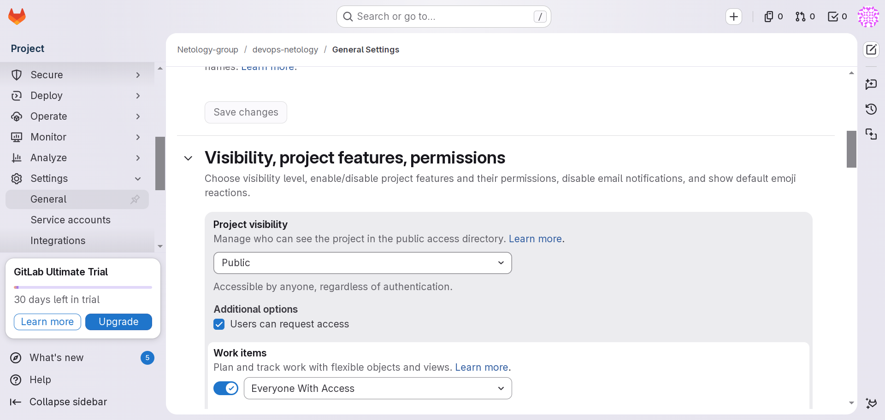</br>
Рисунок 1.2. Настройка доступа репозитория.</br>
Далее был добавлен SSH ключ для доступа к репозиторию. 

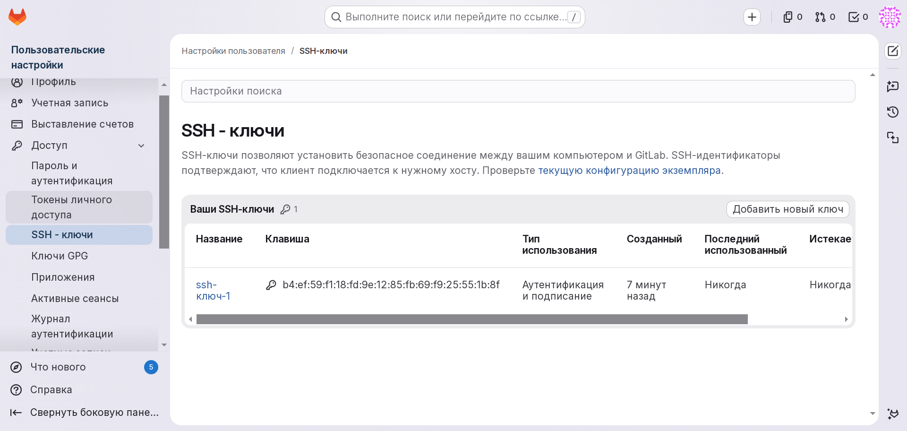</br>
Рисунок 1.3. SSH ключ.</br>
Проверка SSH ключа, добавление удалённого репозитория и синхронизация GitHub с GitLab представлены на рисунке 1.4.</br>

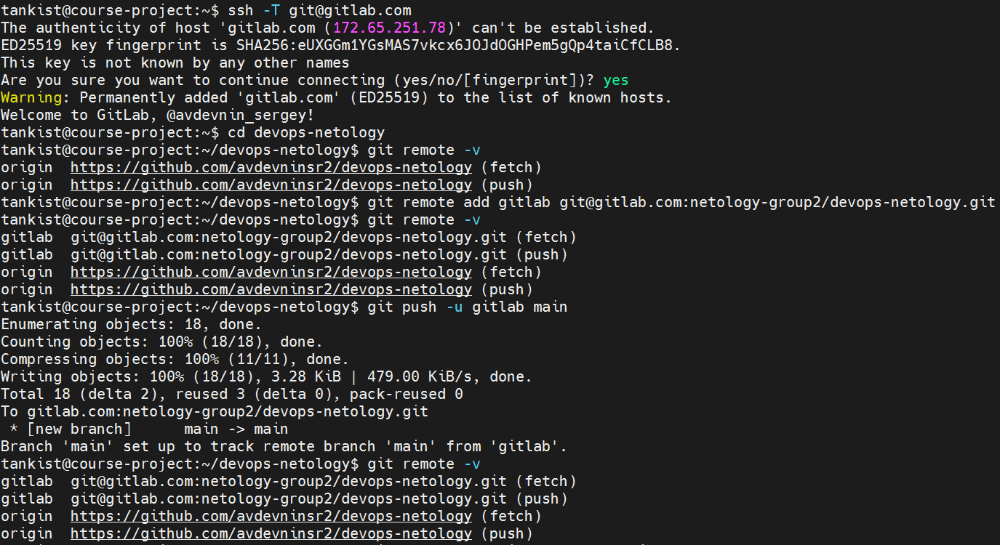</br>
Рисунок 1.4. Проверка SSH ключа, добавление удалённого репозитория и синхронизация GitHub с GitLab.</br>
Реопзиторий из GitHub полностью мигрировал на GitLab, что продемонстрировано на рисунке 1.5.</br>

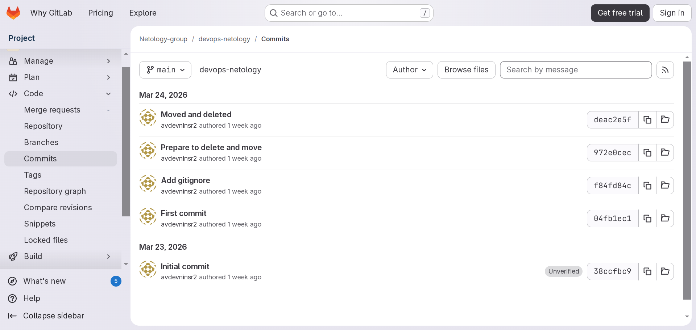</br>
Рисунок 1.5. Коммиты на GitLab.</br>

## Задание 2
Создание легковесного тега продемонстрировано на рисунке 2.1.</br>

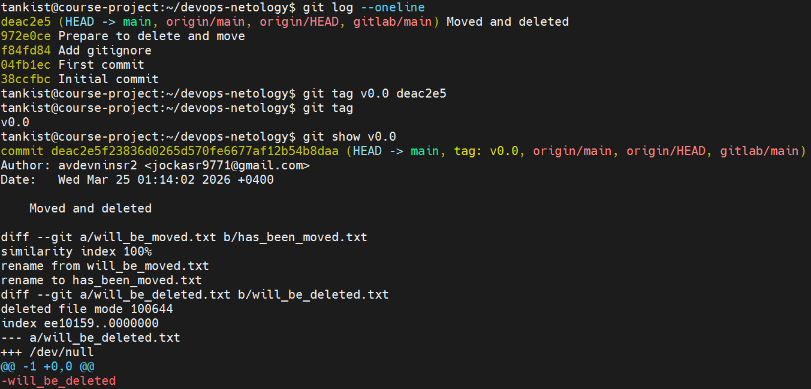</br>
Рисунок 2.1. Создание легковесного тега.</br>
Внес изменения в файл README.md, закоммитил и запушил в репозиторий. Добавился новый хэш. Для него создал аннотированный тег v0.1, что отображено на рисунке 2.2.</br>

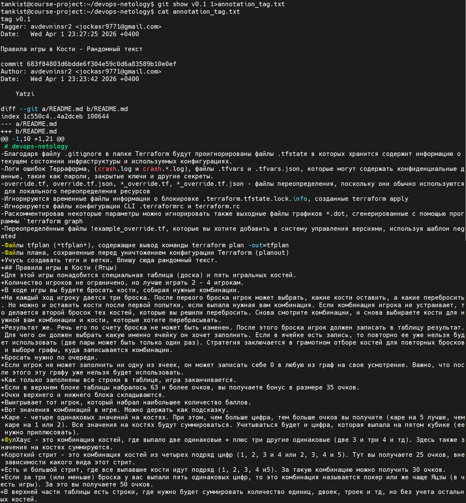</br>
Рисунок 2.2. Создание аннотированного тега.</br>
Проверка коммитов:
```
tankist@course-project:~/devops-netology$ git log --oneline
683f848 (HEAD -> main, tag: v0.1, origin/main, origin/HEAD, gitlab/main) Yatzi
deac2e5 (tag: v0.0) Moved and deleted
972e0ce Prepare to delete and move
f84fd84 Add gitignore
04fb1ec First commit
38ccfbc Initial commit
```
Аннотированный тег, в отличии от обычного, содержит в себе больше описания. Например, видно кто тег создал, дату и время создания, комментарий к тегу и изменения, которые произошли в коммите.</br>
Пуш тегов в репозитории:
```
tankist@course-project:~/devops-netology$ git push origin --tags
Username for 'https://github.com': avdevninsr2
Password for 'https://avdevninsr2@github.com':
Enumerating objects: 1, done.
Counting objects: 100% (1/1), done.
Writing objects: 100% (1/1), 225 bytes | 225.00 KiB/s, done.
Total 1 (delta 0), reused 0 (delta 0), pack-reused 0
To https://github.com/avdevninsr2/devops-netology
 * [new tag]         v0.0 -> v0.0
 * [new tag]         v0.1 -> v0.1
tankist@course-project:~/devops-netology$ git push gitlab --tags
Enumerating objects: 1, done.
Counting objects: 100% (1/1), done.
Writing objects: 100% (1/1), 225 bytes | 225.00 KiB/s, done.
Total 1 (delta 0), reused 0 (delta 0), pack-reused 0
To gitlab.com:netology-group2/devops-netology.git
 * [new tag]         v0.0 -> v0.0
 * [new tag]         v0.1 -> v0.1
```
Теги в веб интерфейсе GitHub и GitLab представлены на рисунках 2.3 и 2.4 соответственно.</br>

</br>
Рисунок 2.3. Теги в веб интерфейсе GitHub.</br>

</br>
Рисунок 2.4. Теги в веб интерфейсе GitLab.</br>

## Задание 3

Из - за технических сложностей схема коммитов репозитория на GitHub не обновляется, (на GitLab обновилась), кроме того из - за конфликта веток на GitHub ветку fix пришлось полностью удалять и пересоздавать (на GitLab таких проблем не было), поэтому хеши коммитов на скриншотах и в репозиториях могут не совпадать.</br>
В начале выполнения данного задания мы находимся в ветке main, указатель HEAD также находится на ветке main.</br>
```
tankist@course-project:~/devops-netology$ git branch && git log --oneline
  fix
* main
683f848 (HEAD -> main, tag: v0.1, origin/main, origin/HEAD, gitlab/main) Yatzi
deac2e5 (tag: v0.0) Moved and deleted
972e0ce Prepare to delete and move
f84fd84 Add gitignore
04fb1ec First commit
38ccfbc Initial commit
```
С помощью команды git log находим нужный коммит, что представлено на рисунке 3.1.</br>

</br>
Рисунок 3.1. Нужный коммит.</br>
Перевод указателя на коммит Moved and deleted и создание новой ветки fix продемонстрированы рисунке 3.2.</br>

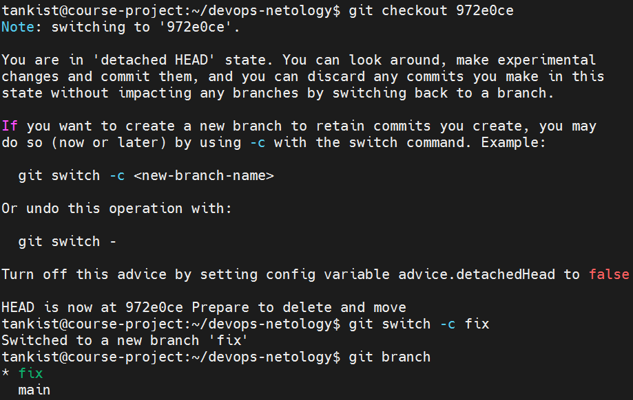</br>
Рисунок 3.2. Перевод указателя на коммит Moved and deleted и создание новой ветки fix.</br>
Публикация новой ветки fix представлена на рисунке 3.3.</br>

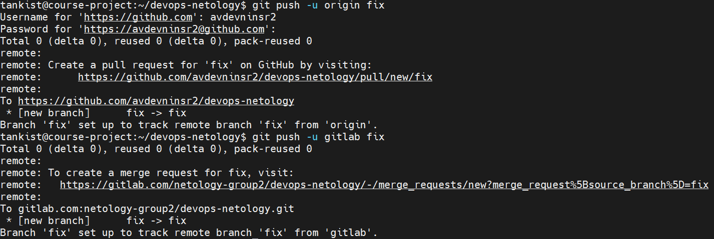</br>
Рисунок 3.3. Публикация новой ветки fix.</br>
Схемы коммитов в GitHub и GitLab представлены на рисунках 3.4 и 3.5 соответственно.</br>

</br>
Рисунок 3.4. Схема коммитов в GitHub.</br>

</br>
Рисунок 3.5. Схема коммитов в GitLab.</br>
Переделка файла README.md, добавление нового коммита и вывод команды git log --oneline после этого представлены на рисунке 3.6.</br>

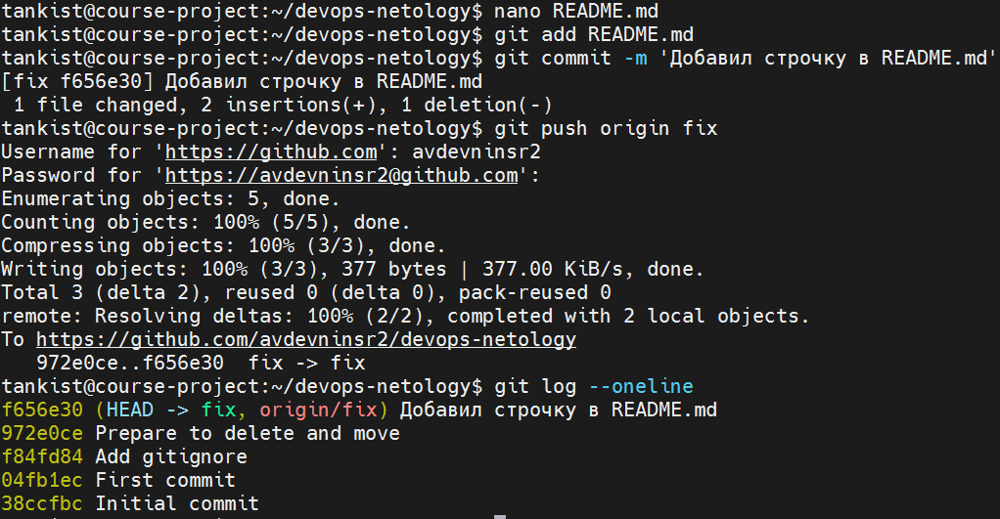</br>
Рисунок 3.6. Добавление коммита в ветку fix.</br>
Изменения в схеме коммитов после проделанных действий продемонстрированны на риунке 3.7.</br>

</br>
Рисунок 3.7. Обновлённая схема коммитов.</br>

## Задание 4

В качестве IDE для работы с Git была выбрана VS Code, так как PyCharm на ПК у меня нет, я никогда ей не пользовался и не вижу смысла "плодить" IDE. Кроме того в лекциях используется именно VS Code.</br>

В самом начале работы необходимо открыть новое окно и выбрать "Клонировать репозиторий" на стартовой странице как показано на рисунке 4.1.</br>

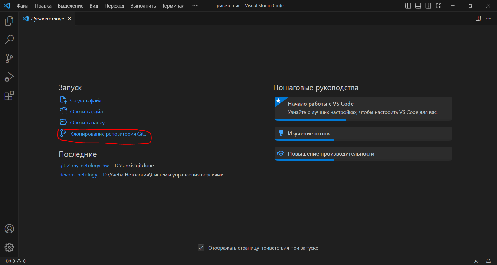</br>
Рисунок 4.1. Начало работы.</br>

Далее после открытия склонированного репозитория можно работать с файлами, а также видеть историю их изменений, что представлено на рисунках 4.2 и 4.3.</br>

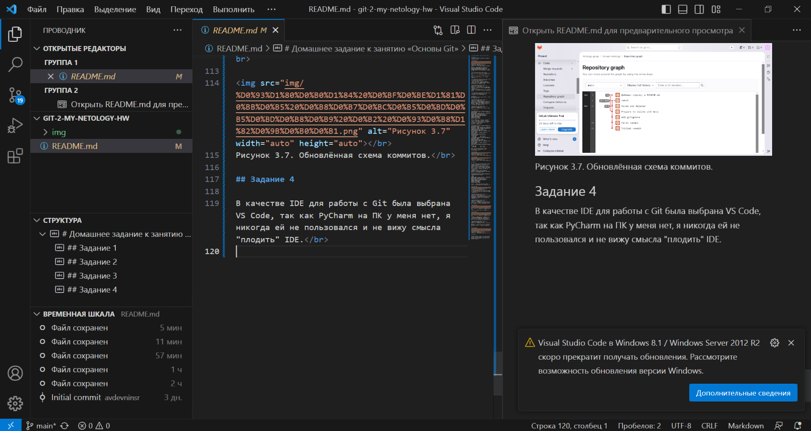</br>
Рисунок 4.2. Редактор файлов, предварительный просмотр и общая история изменений.</br>

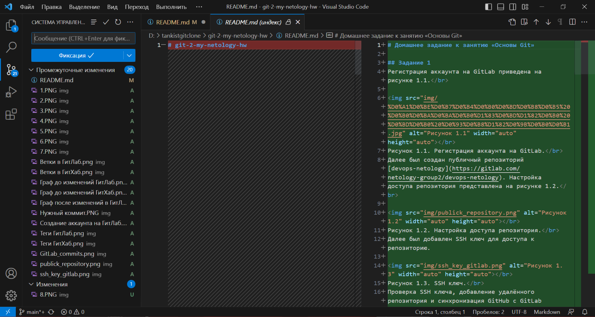</br>
Рисунок 4.3. Редактор файлов, предварительный просмотр и история изменения конкретного файла.</br>

Для различных ддействий с репозиторием в VS Code предусмотрен терминал, в котором в качестве командной оболочки можно выбрать Git bash, что продемонстрированно на рисунке 4.4.</br>

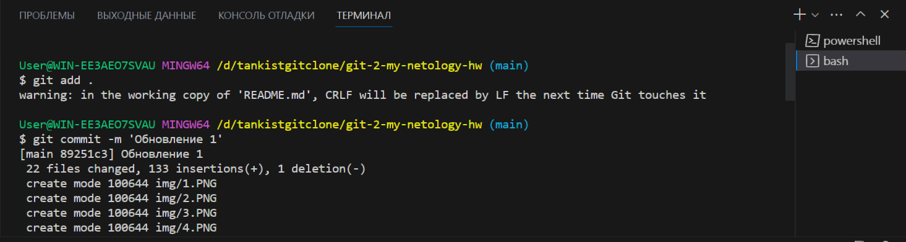</br>
Рисунок 4.4. Терминал и коммиты.</br>

Через терминал можно также запушить репозиторий на GitHub, что показано на рисунке 4.5.</br>

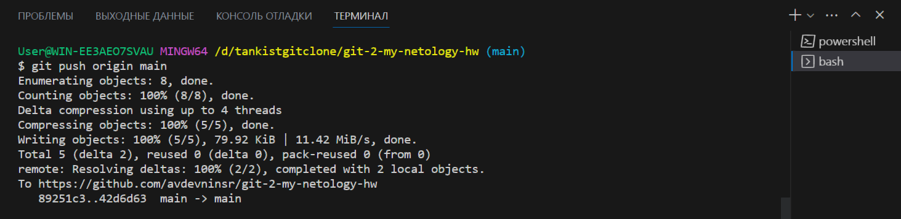</br>
Рисунок 4.5. Пуш репозитория на GitHub.</br>
